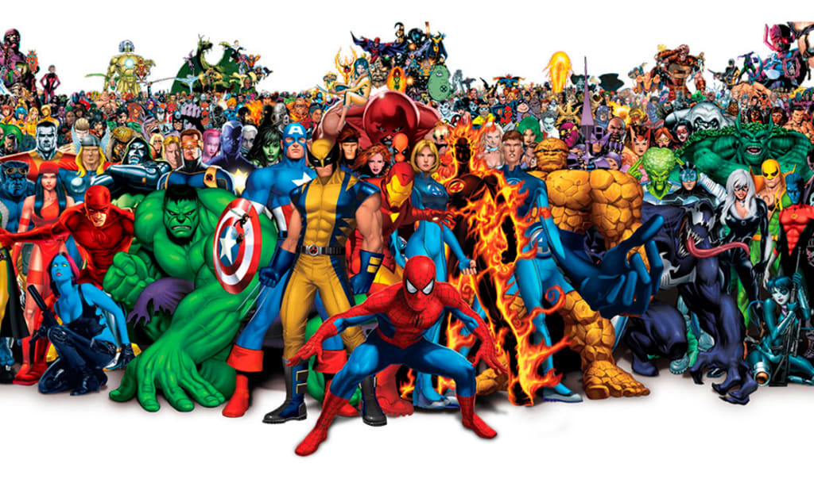

### **Welcome to the Superhero Exploration!**

We’ve all experienced the thrill of superhero movies that keep us on the edge of our seats. Superheroes captivate us not only with their world-saving heroics but also with the unique qualities that make them larger than life. But here’s the catch: superheroes are often confined to their own universes, rarely crossing paths. What if we could break those barriers? In this project, we bring together heroes and villains from Marvel, DC, and beyond, exploring their strengths, weaknesses, and defining traits. We also try to uncover the secrets of a superhero —— what are the important dimensions makes a superhero powerful? Even better, we empower you to define your own superhero standards—create your ideal hero and discover the one that perfectly matches your vision.

[image source](https://vocal.media/geeks/how-superhero-movies-have-influenced-pop-culture-and-the-world)

### **Data Source** 

Our journey starts with data from [kaggle website](https://www.kaggle.com/datasets/shreyasur965/super-heroes-dataset). We’ve refined it to focus on the most intriguing traits—intelligence, strength, speed, durability, power, height, weight and more—to bring their stories to life through clean and insightful visuals.

Curious about the dataset? Check out our [Data Source page](source.html) for viewing how we prepared this.

### **Dive into the Superhero Universe (EDA)** 

Maybe you want to know the distribution of superhero abilities, attributes and alignments; maybe you want to know which publishers these superheroes come from; or even you want to know what are the characteristics of the appearance of these heroes... In the Superheroes [Exploratory Data Analysis section](eda.html), you can find out anything you want to know about superheroes. At the end of this section, we've clustered the superheroes into three groups: the balanced group, the strength group, and the mediocre group. Come to find out which group your favorite superhero is placed in!

### **The Secrets Behind Superheroes' Power (Model Building)**

Among various superhero power dimensions including intelligence, strength, speed, even hair color and eye color, which are the most important one? In our Model Building Section, we used advanced statistical models and machine learning techniques to identify the most impactful traits for a powerful superhero.   

Here is the [model building](model.html) process.

### **Pick your superhero!**

**Here is why we designed this project in the first place.**

Ever dreamt of crafting the perfect superhero? Now you can! With our Pick Your Superhero Tool, you decide what traits matter most. Adjust sliders for intelligence, strength, or speed, and we’ll find heroes or villains who match your unique preferences.

But we didn’t stop there. Our team believes that every user can find inspiration to become their own superhero. This interactive experience isn’t just about characters—it’s about discovering the hero in you.
Want to start your journey? Click [here](https://cj0915.shinyapps.io/shinyapp/)  to explore the superhero universe tailored just for you.

### **Report**

Visit [here](report.html) to review detailed report.

### **Inspire Your Inner Hero**

Whether you’re here to find the strongest superhero, learn more about their world, or just have fun exploring, our goal is simple: to make sure you leave feeling empowered. The real superhero is you, and we’re here to show you how to shine.

Start your journey now and uncover the secrets of the most iconic characters in history. Who knows? You might just find your hero… or become one.

[image source](https://medium.com/@anilkumarjangir/be-your-own-hero-more-accurate-superhero-a4a0f630f1d7)