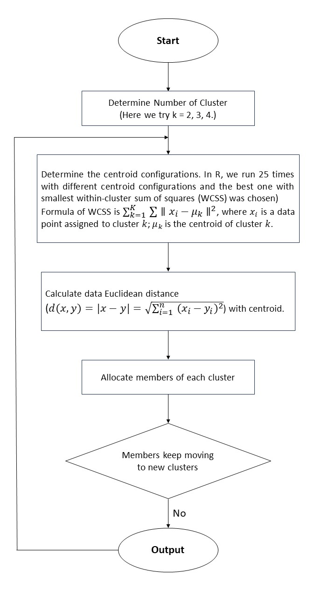
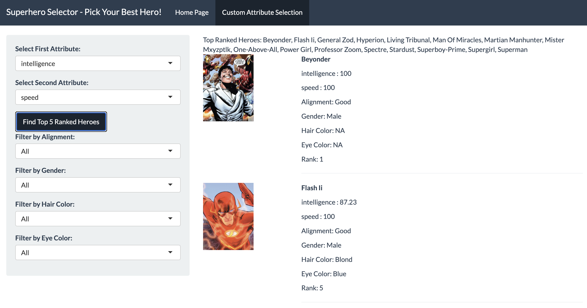

```{r message=FALSE, warning=FALSE}
library(tidyverse)
library(naniar)
library(stringr)
library(janitor)
library(dplyr)
library(plotly)
library(factoextra)
library(gridExtra)
library(kableExtra)
library(knitr)
library(tableone)
library(fmsb)
library(modelr)
library(mice)
library(mgcv)
library(randomForest)
library(readr)
library(patchwork)
library(car)
set.seed(1)
```

# **1. Motivation**

The superhero universe is rich with complex characters who embody a wide range of skills, powers, and moral alignments. This project aims to explore the attributes and dynamics of superheroes and villains, drawing comparisons between their strengths, weaknesses, affiliations, and other characteristics. Finally, We will build an interactive tool where users can input their desired weight of each capability, such as intelligence, strength, or power, to find heroes and villains that match their preferences. This feature will allow superhero comic fanatics to explore characters based on personalized criteria, creating a more engaging and customizable experience.

# **2. Related Work**

As we all are the fans of superheros, this project is inspired by those fascinating superhero movies. Some of our favorite movies are Iron Man 123, The Avengers, Dr. Strange, Guardians of the Galaxy, which motivates us to explore the attributes of heroes and villians. 

# **3. Initial questions** 

Our initial goal was broad: to compare superheroes across multiple universes and identify ones that resonate with individual preferences. 

As we delved deeper into the data set and explored its diverse dimensions, our questions became more focused: 

  - Are there correlations among superheroes' power dimensions or physical characteristics?   
  - Do different publishers have preferences in creating characters with specific         alignments or characteristics?   
  
  - How do power levels vary across characters with different alignments? 
  
  - Can we cluster superheroes based on their numeric attributes, and what insights can these clusters provide? 
  
  - What are the key factors that determine a superhero's overall power?

All of those questions drive our analysis and help to satisfy our curiosity.

# **4. Data Source and Data Cleaning Process**

## **4.1. Data Source**

Our data source is from [kaggle website](https://www.kaggle.com/datasets/shreyasur965/super-heroes-dataset). This dataset covers detailed information on 731 superheroes and villains from various comic universes. It includes a wide range of attributes such as capability statistics, biographical information, physical appearance, and affiliations. The data was collected using the SuperHero API.The original dataset is called `superheroes_data`.

## **4.2. Data Cleaning Process**

```{r message=FALSE}
superheroes_df <- read_csv(
  "./data/superheroes_data.csv",
  na = c("NA", ".", "", "null", "-")
) |>
  janitor::clean_names() |>
  mutate(
    height_cm = str_extract(height, "\\d+(?= cm)") |> as.numeric(),
    height_cm = if_else(height_cm == 0, NA_real_, height_cm),
    weight_kg = str_extract(weight, "\\d+(?= kg)") |> as.numeric(),
    weight_kg = if_else(weight_kg == 0, NA_real_, weight_kg),
    hair_color = if_else(str_detect(hair_color, "/"), "Dual Color", hair_color),
    eye_color = str_remove_all(eye_color, "\\(.*?\\)") |> str_trim(),
    eye_color = if_else(str_detect(eye_color, "/"), "Dual Color", eye_color)
  ) |>
  mutate(across(
    where(is.character) & !any_of("url"), 
    ~ str_to_title(.)
  )) |>
  select(
    -aliases, -height, -weight, -base, -occupation, -group_affiliation, -relatives, -alter_egos, -place_of_birth, -first_appearance, -race
  )

superheros <- superheroes_df

publisher_counts <- superheros |>
  group_by(publisher) |>
  summarise(hero_count = n()) |>
  arrange(desc(hero_count))

single_hero_publishers <- filter(publisher_counts, hero_count == 1) |>
  pull(publisher)

superheros <- superheros |>
  mutate(publisher = ifelse(publisher %in% single_hero_publishers, "Others", publisher))

alignment_counts <- superheros |>
  group_by(alignment) |>
  summarise(hero_count = n()) |>
  arrange(desc(hero_count))

gender_counts <- superheros |>
  group_by(gender) |>
  summarise(hero_count = n()) |>
  arrange(desc(hero_count))

eye_color_counts <- superheros |>
  group_by(eye_color) |>
  summarise(hero_count = n()) |>
  arrange(desc(hero_count))

single_hero_eye_color <- filter(eye_color_counts, hero_count == 1) |>
  pull(eye_color)

superheros <- superheros |>
  mutate(eye_color = ifelse(eye_color %in% single_hero_eye_color, "Others", eye_color))

hair_color_counts <- superheros |>
  group_by(hair_color) |>
  summarise(hero_count = n()) |>
  arrange(desc(hero_count))

single_hero_hair_color <- filter(hair_color_counts, hero_count == 1) |>
  pull(hair_color)

superheros <- superheros |>
  mutate(hair_color = ifelse(hair_color %in% single_hero_hair_color, "Others", hair_color))
```

However, we are not interested in each variables in `superheroes_data` dataset. In addition, some of the data in this original dataset is not readable and analyzable. As a result, we conducted the following data cleaning process:

* When importing data, we set "NA", ".", "", "null", and “-” as missing values;

* We harmonized the height of heroes in cm and their weight in kg;

* We marked heroes with a height and weight of 0 as missing values: they are meaningless;

* If a hero has two hair colors or two eye colors (e.g. Blue/Yellow), we marked this color as 'Dual Color';

* We also reclassified some categorical variables. Specifically, if a `publisher` contains only one hero, then the publisher to which this hero belongs will be noted as 'Others'. We did the same for the variables `alignment`, `eye_color`, and `hair_color`.

* We selected only the variables we were interested and deleted `aliases`, `base`, `occupation`, `group_affiliation`, `relatives`, `alter_egos`, `place_of_birth`, `first_appearance`, `race`. These variables are documented in a way that is difficult to read and difficult to clean.

## **4.3. Cleaned Dataset**

The cleaned dataset is tidy, readable and analyzable. It includes the following variables:

`id`: A unique identifier for each character.

`name`: The superhero's alias or code name.

`intelligence`: A numerical representation of the character's intelligence level.

`strength`: A numerical value representing the character's physical strength.

`speed`: A numerical representation of how fast the character can move.

`durability`: A measure of the character’s resilience and ability to withstand damage.

`power`: A numerical value representing the character's overall power or abilities.

`combat`: A score depicting the character’s combat skills and experience.

`full-name`: The character’s real or full name, as opposed to their superhero alias.

`publisher`: The company responsible for creating and publishing the character.

`alignment`: Whether the character is good, evil, or neutral.

`gender`: The gender of the character.

`height_cm`: The character’s height, given in centimeters.

`weight_kg`: The character’s weight, provided in kilograms.

`eye-color`: The color of the character’s eyes.

`hair-color`: The color of the character’s hair.

`url`: A link to an image of the character or more detailed information.

# **5. EDA**

## **5.1. Numerical data**

```{r message = FALSE, warning = FALSE}
superheros <- read_csv("./data/superheroes.csv")

# Box plot

numeric_vars <- superheros |>
  select(intelligence, strength, speed, durability, power, combat, height_cm, weight_kg)

plots <- lapply(names(numeric_vars), function(var) {
  plot_ly(y = numeric_vars[[var]], type = "box", name = var)
})

boxplot_combined <- subplot(plots, nrows = 3, margin = 0.05)

boxplot_combined


# Correlation Matrix

cor_matrix <- cor(numeric_vars, use = "complete.obs")

cor_heatmap <- plot_ly(
  z = cor_matrix,
  x = colnames(cor_matrix),
  y = colnames(cor_matrix),
  type = "heatmap",
  colors = colorRampPalette(c("lightblue", "blue", "darkblue"))(100)
) %>%
  layout(
    title = "Correlation Matrix Heatmap",
    xaxis = list(title = "Variables"),
    yaxis = list(title = "Variables")
  )

cor_heatmap
```

### **5.1.1. Attributes of characters**

The numerical data in the superhero dataset reveals detailed insights into the attributes of various characters.

* Intelligence values range from 6 to 100, with a median of 63, and an interquartile range (IQR) from 50 to 75, indicating that most superheroes possess above-average intelligence, though there are a few outliers below 19. 

* Strength varies widely from 4 to 100, with a median of 35, and an IQR spanning 10 to 80, suggesting high variability in physical power among characters. 

* Speed also shows considerable variation, ranging from 1 to 100, with a median of 33 and an upper fence at 88, highlighting the presence of faster-than-average individuals as outliers.

* Durability, which measures resilience, ranges from 1 to 110, with a median of 60 and an IQR from 30 to 90, suggesting that durability is skewed slightly higher for many characters.

* Power spans from 0 to 100, with a median of 63.5 and a compact IQR between 38 and 100, indicating that many characters have significant abilities, although some have very low power levels. 

* Combat skills range from 5 to 101, with a median of 64 and an IQR from 42 to 80, suggesting that fighting ability is moderately high for most characters.

* Physical traits exhibit greater variation. Height ranges from a minimum of 64 cm to an extreme outlier of 975 cm, with a median of 183 cm and an IQR from 175 to 191 cm.

* Similarly, weight spans from 14 kg to an outlier of 900 kg, with a median of 81 kg and an IQR between 61.75 and 108 kg. The correlation between the weight and the height is going to be examed later.

### **5.1.2. Correlation Heatmap**

The correlation matrix heatmap provides a comprehensive view of the relationships between the numerical variables in the superhero dataset. Notably, weight (kg) and height (cm) show a strong positive correlation, indicating that taller superheroes tend to weigh more, which aligns with physical expectations. 

Strength is positively correlated with power and durability, suggesting that characters with greater strength often exhibit higher power and durability. Moreover, power and durability also have a noticeable positive correlation themselves, reflecting that superheroes with greater endurance often possess high energy-based abilities together.

Combat shows moderate positive correlations with intelligence and power, implying that characters proficient in combat tend to be both strategically intelligent and powerful. Speed, however, exhibits weaker correlations with other attributes, especially height, indicating it is a more distinct characteristic. 

## **5.2. Categorical data**

### **5.2.1. Publisher and alignment of distribution**

```{r warning=FALSE}
publisher_counts <- superheros |>
  count(publisher) |>
  arrange(desc(n))

publisher_bar <- plot_ly(publisher_counts, x = ~reorder(publisher, -n), y = ~n, type = 'bar', marker = list(color = '#aec7e8')) |>
  layout(title = "Publisher Distribution (Bar Chart - Sorted by Count)",
         xaxis = list(title = "Publisher"),
         yaxis = list(title = "Count"))

publisher_bar

alignment_counts <- superheros |>
  count(alignment)

alignment_pie <- plot_ly(alignment_counts, labels = ~alignment, values = ~n, type = 'pie',
                        marker = list(colors = c('#98df8a', '#ffbb78', '#9edae5', '#f7b6d2'))) |>
  layout(title = "Alignment Distribution",
         xaxis = list(showgrid = FALSE, zeroline = FALSE, showticklabels = FALSE),
         yaxis = list(showgrid = FALSE, zeroline = FALSE, showticklabels = FALSE))

alignment_pie

marvel_alignment <- superheros |>
  filter(publisher == "Marvel Comics") |>
  count(alignment)

dc_alignment <- superheros |>
  filter(publisher == "Dc Comics") |>
  count(alignment)

# Plot alignment distribution for Marvel Comics
marvel_plot <- plot_ly(marvel_alignment, labels = ~alignment, values = ~n, type = 'pie',
                      marker = list(colors = c('#aec7e8', '#ffbb78', '#98df8a', '#f4cccc'))) |>
  layout(title = "Alignment Distribution - Marvel Comics",
         xaxis = list(showgrid = FALSE, zeroline = FALSE, showticklabels = FALSE),
         yaxis = list(showgrid = FALSE, zeroline = FALSE, showticklabels = FALSE))

# Plot alignment distribution for DC Comics
dc_plot <- plot_ly(dc_alignment, labels = ~alignment, values = ~n, type = 'pie',
                   marker = list(colors = c('#c5b0d5', '#c49c94', '#f9cb9c', '#d9d9d9'))) |>
  layout(title = "Alignment Distribution - DC Comics",
         xaxis = list(showgrid = FALSE, zeroline = FALSE, showticklabels = FALSE),
         yaxis = list(showgrid = FALSE, zeroline = FALSE, showticklabels = FALSE))

marvel_plot
dc_plot
```

The publisher distribution analysis reveals publishers of different characters. It is worth noting that Marvel Comics and DC Comics dominate the superhero dataset, collectively contributing the majority of characters. Marvel leads significantly with around 339 characters, followed by DC with approximately 188 characters. These two publishers are the most well-known in the superhero universe and represent the most iconic and expansive rosters. Due to their prominence and influence, further investigation will focus specifically on the data related to Marvel and DC characters to uncover patterns, differences, and trends unique to these two leading publishers.

In the complete dataset, 67.6% of characters are classified as good, indicating that most superheroes have a positive alignment. Characters with a bad alignment constitute 28.2%, while neutral characters make up only 3.28%, and less than 1% fall into the "null" or undefined category. Within Marvel, the proportion of good characters is slightly lower at 64.9%, suggesting a slightly more diverse representation of moral alignments compared to the overall dataset. Bad characters constitute 31.9%, indicating a larger share of villains in Marvel than neutral characters, which are only 2.95%. The "null" category is negligible at 0.295%. For DC Comics, 61.7% of characters are good, showing a similar but slightly smaller majority compared to Marvel. DC also has a significant portion of bad characters at 31.4%, closely mirroring Marvel's percentage. However, DC has a higher proportion of neutral characters of 6.38%, suggesting a tendency to explore more morally ambiguous characters. The "null" category remains minimal at 0.532%.

In summary, both Marvel and DC emphasize good-aligned characters, but Marvel leans slightly more toward a traditional hero-villain dichotomy, while DC shows a higher representation of neutral or ambiguous characters. These differences reflect the nuanced storytelling and character development strategies employed by the two publishers. 

### **5.2.2. Eye color and Hair color**

```{r warning=FALSE}
eye_color_counts <- superheros |>
  count(eye_color)

eye_color_bar <- plot_ly(eye_color_counts, 
                         x = ~n, 
                         y = ~reorder(eye_color, n), 
                         type = 'bar', 
                         orientation = 'h', 
                         marker = list(color = "#dbdb8d")) |>
  layout(title = "Eye Color Distribution",
         xaxis = list(title = "Count"),
         yaxis = list(title = "Eye Color"))

hair_color_counts <- superheros |>
  count(hair_color)

hair_color_bar <- plot_ly(hair_color_counts, 
                          x = ~n, 
                          y = ~reorder(hair_color, n), 
                          type = 'bar', 
                          orientation = 'h', 
                          marker = list(color = "#c7c7c7")) |>
  layout(title = "Hair Color Distribution",
         xaxis = list(title = "Count"),
         yaxis = list(title = "Hair Color"))

eye_color_bar

hair_color_bar
```

The distribution of eye color and hair color among superheroes reveals interesting patterns in their physical characteristics:

The most common eye color is blue, observed in 225 characters, making it the dominant eye color in the dataset. This is followed by brown eyes with a significant count of 126, and green eyes rounding out the top three. Less common colors such as red, black, and yellow are also present, likely representing unique or supernatural traits among certain characters. Rare eye colors like purple, gold, and amber, as well as characters with dual-colored eyes, indicate a diverse spectrum of visual aesthetics.

For hair color, black is the most frequently observed, with 161 characters having this trait. Blond and brown hair are also highly common, 101 and 86 respectively, reflecting traditional human traits. Interestingly, the category "No Hair" is also prominent, suggesting a significant number of bald or non-human characters. Less common hair colors like red, white, and auburn add variety, while rare colors such as purple, green, and silver showcase the creative range in superhero designs. Unique colors like blue, yellow, and orange appear rarely, often associated with otherworldly or supernatural beings.

## **5.3. Demographic Summary by Alignment and Gender**

```{r message = FALSE}
superheros1 <- superheros |>
  filter(!is.na(alignment), !is.na(gender))

vars <- c("intelligence", "strength", "speed", "durability", "power", "combat", "height_cm", "weight_kg")

alignment_summary <- CreateTableOne(vars = vars, strata = "alignment", data = superheros1, test = TRUE)

alignment_summary_df <- print(alignment_summary, quote = FALSE, noSpaces = TRUE, printToggle = FALSE)

alignment_summary_df |> as.data.frame() |>
  rename(`p-value` = p) |>
  mutate(test = "F-test") |>
  kable()

gender_summary <- CreateTableOne(vars = vars, strata = "gender", data = superheros1, test = TRUE)

gender_summary_df <- print(gender_summary, quote = FALSE, noSpaces = TRUE, printToggle = FALSE)

gender_summary_df |> as.data.frame() |>
  rename(`p-value` = p) |>
  mutate(test = "T-test") |>
  kable()

```

This table summarizes the demographic characteristics of superheroes by alignment ("Bad," "Good," "Neutral") and gender ("Female," "Male"). The mean and standard deviation are provided for attributes such as intelligence, strength, speed, and others. Significant differences are observed among alignment categories for attributes like intelligence, strength, durability, height, and weight, as indicated by F-test p-values. In the gender comparison, significant differences are found in strength, durability, height, and weight, with males generally showing higher values. These statistical tests highlight notable variations in superhero traits based on alignment and gender.

## **5.4 Clustering of superheroes**

Then, we performed a clustering analysis on superheroes using the k-means algorithm. Initially, the attributes, `intelligence`, `strength`, `speed`, `durability`, `power`, `combat`, `height_cm`, and `weight_kg` were extracted into a subset called `numeric_vars`. Missing values were removed from this subset to ensure only complete cases (428 cases) were used in the clustering analysis, which is crucial for obtaining reliable clustering results. The cleaned data (`numeric_vars_clean`) was then standardized using the `scale()` function, ensuring that all variables are on the same scale and do not unduly influence the clustering due to differences in magnitude.

The analysis involved applying the k-means algorithm with different numbers of clusters (k = 2, k = 3, and k = 4) to the scaled data, represented by `numeric_vars_scaled`. The k-means algorithm attempts to partition the data into k distinct clusters based on minimizing within-cluster variances. The use of `nstart = 25` indicates that the algorithm will be run 25 times with different initial centroid configurations, and the best result (in terms of minimizing within-cluster sum of squares) will be chosen. This approach helps avoid local minima and provides a more robust clustering outcome. To help users better understand the k-means, a flowchart about how this algorithm works was attached here:



For each value of k (2, 3, and 4), the resulting clusters are visualized using the `fviz_cluster()` function, which plots the superheroes based on their clustering assignment. The `geom = "point"` argument indicates that individual data points are plotted, and the `ellipse.type = "convex"` argument represents each cluster with a convex hull to visually distinguish different groups.

```{r}
numeric_vars <- superheros |>
  select(intelligence, strength, speed, durability, power, combat, height_cm, weight_kg)
superheros_clean <- superheros[complete.cases(numeric_vars), ]
numeric_vars_clean <- superheros_clean |>
  select(intelligence, strength, speed, durability, power, combat, height_cm, weight_kg)

numeric_vars_scaled <- scale(numeric_vars_clean)

set.seed(123)

kmeans_result_2 <- kmeans(numeric_vars_scaled, centers = 2, nstart = 25)
plot_2 <- fviz_cluster(kmeans_result_2, data = numeric_vars_scaled,
                       geom = "point",
                       ellipse.type = "convex",
                       ggtheme = theme_minimal()) +
  labs(title = "k = 2")

kmeans_result_3 <- kmeans(numeric_vars_scaled, centers = 3, nstart = 25)
plot_3 <- fviz_cluster(kmeans_result_3, data = numeric_vars_scaled,
                       geom = "point",
                       ellipse.type = "convex",
                       ggtheme = theme_minimal()) +
  labs(title = "k = 3")

kmeans_result_4 <- kmeans(numeric_vars_scaled, centers = 4, nstart = 25)
plot_4 <- fviz_cluster(kmeans_result_4, data = numeric_vars_scaled,
                       geom = "point",
                       ellipse.type = "convex",
                       ggtheme = theme_minimal()) +
  labs(title = "k = 4")

grid.arrange(plot_2, plot_3, plot_4, ncol = 3)
```

The figure above shows the clustering analysis, where k-means method was applied with different values for the number of clusters (k=2,3,4).

* In the first plot (k=2), the data points are grouped into two cluster. Compared to k = 3, two clusters are insufficient to adequately capture the diversity within the data, resulting in misclassification and poor separation between distinct groups.

* In the third plot (k=4), the data is divided into four clusters. There is evidence of over-classification, with cluster 1 and cluster 3 overlapping to much with each other.

* In the third plot (k=3), the clustering with three clusters appears to strike the right balance. The distinct groups are more clearly defined compared to k=2. Unlike k=4, there is no evidence of excessive fragmentation. This value, k=3, captures the major variations while maintaining well-separated and interpretable groups.

### **5.4.1 List of clustering**

Here is the list of superheroes in each clustering group.You may find your favourite superhero here.

```{r}
superheros_clean$cluster <- kmeans_result_3$cluster

superheros_clean |>
  group_by(cluster) |>
  summarise(heroes = paste(name, collapse = ", ")) |>
  kable()
```

### **5.4.2. Check capability statistics within each cluster group**

We also digged into the average capability statistics within each cluster group to learn about the feature of each group.

```{r}
superheros_clean |>
  group_by(cluster) |>
  summarise(
    intelligence_mean = mean(intelligence, na.rm = TRUE),
    intelligence_sd = sd(intelligence, na.rm = TRUE),
    strength_mean = mean(strength, na.rm = TRUE),
    strength_sd = sd(strength, na.rm = TRUE),
    speed_mean = mean(speed, na.rm = TRUE),
    speed_sd = sd(speed, na.rm = TRUE),
    durability_mean = mean(durability, na.rm = TRUE),
    durability_sd = sd(durability, na.rm = TRUE),
    power_mean = mean(power, na.rm = TRUE),
    power_sd = sd(power, na.rm = TRUE),
    combat_mean = mean(combat, na.rm = TRUE),
    combat_sd = sd(combat, na.rm = TRUE),
    height_mean = mean(height_cm, na.rm = TRUE),
    height_sd = sd(height_cm, na.rm = TRUE),
    weight_mean = mean(weight_kg, na.rm = TRUE),
    weight_sd = sd(weight_kg, na.rm = TRUE)
  ) |>
  pivot_longer(-cluster, names_to = c("variable", ".value"), names_sep = "_") |>
  mutate(mean_sd = paste0(round(mean, 2), " (", round(sd, 2), ")")) |>
  select(variable, cluster, mean_sd) |>
  pivot_wider(names_from = cluster, values_from = mean_sd, names_prefix = "cluster") |>
  kable()
```

The table presents the average values (with standard deviations) of several attributes for superheroes categorized into three clusters. Each row represents a different variable, including intelligence, strength, speed, durability, power, combat, height, and weight. Cluster 1, characterized by moderate values for most attributes, shows relatively balanced abilities, particularly in intelligence and power. Cluster 2 displays the highest average values for strength, durability, height, and weight, indicating that members of this cluster are likely to be physically dominant. Conversely, Cluster 3 exhibits lower values for attributes like strength, speed, and weight, suggesting that the superheroes in this cluster might rely less on physical prowess compared to the other clusters.

### **5.4.3. Radar Plot!**

The radar plot below is a visualization of superhero 6 capabilities values in each group from the previous section.

```{r warning=FALSE}
library(fmsb)
cluster_averages <- superheros_clean |>
  group_by(cluster) |>
  summarise(
    intelligence = mean(intelligence, na.rm = TRUE),
    strength = mean(strength, na.rm = TRUE),
    speed = mean(speed, na.rm = TRUE),
    durability = mean(durability, na.rm = TRUE),
    power = mean(power, na.rm = TRUE),
    combat = mean(combat, na.rm = TRUE)
  )

radar_data <- as.data.frame(cluster_averages)
radar_data <- radar_data[, -1]

radar_data <- rbind(rep(100, 6), rep(0, 6), radar_data)

colors_border <- c('#f08080', '#90ee90', '#87cefa')
colors_in <- c('#ffcccb', '#c6e7c6', '#b0e0e6')

radarchart(radar_data, axistype = 2, 
           pcol = colors_border, 
           pfcol = adjustcolor(colors_in, alpha.f = 0.6), plwd = 2.5, plty = 1,
           cglcol = "grey", cglty = 1, 
           axislabcol = "black")

legend(x = "topright", legend = paste("Cluster", 1:3), pch = 20, col = colors_border, text.col = "black", cex = 1.2, pt.cex = 2)
```

# **6. Model Building for Superhero’s Power**

Among all these variables such as intelligence, strength, speed, durability, combat, height, weight, gender, alignment, we were interested in knowing what factors contribute the most to a superhero’s power, which is defined as representing the character's overall power or abilities. Therefore, the goal is to identify key predictors of superhero power, evaluate model performance, and validate the results using advanced methods such as Random Forest. 

## **6.1 Univariate Analysis** 

A univariate analysis was performed to determine which predictors (independent variables) are significantly associated with `power` (dependent variable) at 0.05 significance level.
```{r}
superheros <- read_csv("./data/superheroes.csv",  show_col_types = FALSE)

superheros_clean1 <- superheros %>% 
  filter(complete.cases(intelligence, strength, speed, durability, combat, height_cm, weight_kg, gender, alignment, power))

superheros_clean1$gender <- as.factor(superheros_clean1$gender)
superheros_clean1$alignment <- as.factor(superheros_clean1$alignment)
univariate_analysis = function(var, var_name){
  model = summary(lm(power ~ var, data = superheros_clean1))
  p_value = model$coefficients[2, 4]
  return(data.frame(variable = var_name, p_value = p_value))
}

results = rbind(
  univariate_analysis(superheros_clean1$intelligence, "Intelligence"),
  univariate_analysis(superheros_clean1$strength, "Strength"),
  univariate_analysis(superheros_clean1$speed, "Speed"),
  univariate_analysis(superheros_clean1$durability, "Durability"),
  univariate_analysis(superheros_clean1$combat, "Combat"),
  univariate_analysis(superheros_clean1$height_cm, "Height"),
  univariate_analysis(superheros_clean1$weight_kg, "Weight"),
  univariate_analysis(superheros_clean1$gender, "Gender"),
  univariate_analysis(superheros_clean1$alignment, "Alignment")
)

results$p_value <- round(results$p_value, 4)
library(knitr)
kable(results, col.names = c("Variable", "P-Value"), digits = 4, align = "c")
```
Based on the results, `intelligence`, `strength`, `speed`, `durability`, `weight` are significantly associated with the power with p-value < 0.05. 

Next, A linear regression model was built using the significant predictors from univariate analysis.  
```{r}
sig_model = lm(power ~ intelligence + strength + speed + durability + weight_kg, data = superheros_clean1) 

sig_model %>% 
  broom::tidy() %>% 
  dplyr::select(term, estimate, p.value) %>% 
  knitr::kable(digits = 4)
```
All of the variables are statistically significant associated with the power at 0.05 level except for `weight`. From the table, we can conclude that as the `intelligence`, `strength`, `speed`, and `durability` increase respectively, superheroes' `power` also increases, as indicated by the positive estimates.


## **6.2 Model selection**
Forward, backward, and stepwise selection methods were used to refine the model. Based on these methods, three competing models were built:

Model A: `Intelligence`, `Speed`, `Durability`.

Model B: `Intelligence`, `Strength`, `Speed`, `Durability`.

Model C: All variables: `Intelligence`, `Strength`, `Speed`, `Durability`, `Combat`, `Height`, `Weight`, `Alignment`, `Gender`.


## **6.3 Model comparison and evaluation**
Three models were evaluated using cross-validation repeated 100 times. Root Mean Squared Error (RMSE) distributions were compared.

From the figure, Model B has the relatively lowest RMSE distribution overall. In addition, AIC was also assessed, and Model B also has the lowest value. Therefore, Model B was selected as the final model due to its superior predictive performance and simplicity.

```{r}
cv_df =
  crossv_mc(superheros_clean1, 100) |> 
  mutate(
    train = map(train, as_tibble),
    test = map(test, as_tibble))

cv_df = 
  cv_df |> 
  mutate(
    lm_modelA  = map(train, \(df) lm(power ~ intelligence + speed + durability, data = df)),
    lm_modelB = map(train, \(df) lm(power ~ intelligence + strength + speed + durability, data = df)),
    lm_modelC = map(train, \(df) lm(power ~ intelligence + strength + speed + durability + combat + height_cm + weight_kg + alignment, data = df))) %>%  
  mutate(
    rmse_modelA = map2_dbl(lm_modelA, test, \(mod, df) rmse(model = mod, data = df)),
    rmse_modelB = map2_dbl(lm_modelB, test, \(mod, df) rmse(model = mod, data = df)),
    rmse_modelC = map2_dbl(lm_modelC, test, \(mod, df) rmse(model = mod, data = df)))

cv_df |> 
  dplyr::select(starts_with("rmse")) |> 
  pivot_longer(
    everything(),
    names_to = "model", 
    values_to = "rmse",
    names_prefix = "rmse_") |> 
  mutate(model = fct_inorder(model)) |> 
  ggplot(aes(x = model, y = rmse)) + geom_violin()
```

```{r}
lm_modelA <- lm(power ~ intelligence + speed + durability, data = superheros_clean1)
lm_modelB <- lm(power ~ intelligence + strength + speed + durability, data = superheros_clean1)
lm_modelC <- lm(power ~ intelligence + strength + speed + durability + combat + height_cm + weight_kg + alignment + gender, data = superheros_clean1)
aic_values <- data.frame(
  Model = c("Model A", "Model B", "Model C"),
  AIC = c(
    AIC(lm_modelA),
    AIC(lm_modelB),
    AIC(lm_modelC)
  )
)  

library(knitr)
kable(
  aic_values,
  col.names = c("Model", "AIC"),
  digits = 2,
  align = "c",
  caption = "AIC Comparison for Models"
)
```


## **6.4 Random Forest Model to Verify Predictors**

To verify and enhance our model for predicting superhero powers, we used a random forest model to complement and validate insights from our statistical analyses, providing an additional predictive layer.

The random forest algorithm is a supervised learning method that constructs multiple decision trees using subsets of the data and features, then aggregates their predictions to improve accuracy and robustness. Compared to single decision trees, random forests are less prone to overfitting due to their ensemble approach, though careful tuning of hyperparameters remains important to ensure optimal performance. This method allowed us to validate our findings from a predictive perspective while mitigating the risk of overfitting inherent in individual tree-based models.

```{r}
set.seed(123)

rf_model <- randomForest(power ~ combat + strength + speed + durability + intelligence + height_cm + weight_kg + gender + alignment, data = superheros_clean1, mtry = 3, ntree = 100, importance = TRUE)

importance <- importance(rf_model)
varImpPlot(rf_model)
```

From the variable importance plot, we found that speed, durability, strength, and intelligence are the most important variables for improving the model’s predictive performance and better fit as they have a larger %IncMSE and increase in Node Purity, which is consistent with our model. Therefore, `intelligence`, `Strength`, `Speed`, `Durability` was identified as the primary contributors to superheroes' `power`. 


## **6.5 Conclusion**
Our final model would be: `lm_modelB <- lm(power ~ intelligence + strength + speed + durability)`

Look at Model B:
```{r}
lm_modelB <- lm(power ~ intelligence + strength + speed + durability, data = superheros_clean1) %>% 
  broom::tidy() %>% 
  dplyr::select(term, estimate, p.value) 

kable(lm_modelB, digits = 4)
```
Based on the results, `intelligence`, `Strength`, `Speed`, and `Durability` are positively related to `power`. For one-unit increase in `speed`, it causes the largest increase in `power`, while one-unit increase in `strength` causes the least increase.

# **7. R Shinny App: Pcik Your Hero**

Users can use this shinny app to identify 5 top ranked heroes based on their preferences on speed, intelligence, durability, strength, combat, and power, then can pick their hero among these 5 heroes by filtering alighment, gender, hair color, and eye color.

{width=75%}

# **8. Discussion**

We found that characters with a high combination of mental acuity (intelligence), physical prowess (strength and durability), and agility (speed) tend to possess greater overall power, which align with our expectations for superheroes, emphasizing a blend of physical and mental capabilities. In addition, from cross validation and random forest analysis, we could confirm that speed, durability, strength, and intelligence were the most critical variables for predicting power. One surprising finding was the high contribution of speed to power, as it often takes a backseat to strength or combat skills in storytelling.

Good alignment dominated the data set and this prevalence of good-aligned characters reflects traditional superhero narratives. However, we found the bad alignment had overall higher intelligence, strength, durability, power, combat, height, and weight than good alignment. One reason we thought might explain this was that villains were often designed to present formidable challenges to heroes, necessitating higher physical and mental attributes to justify their role as significant threats. 

Male characters tended to have higher strength, durability, and physical attributes, while female characters often exhibited higher agility and intelligence. This gender differences in attributes aligned with stereotypes in superhero depictions, and we hope this analysis can help modern comics create more nuanced and diverse characters that break traditional norms.

We also distinct superhero types by clustering them into 3 groups: heroes in cluster1 had relatively balanced attributes, cluster 2 included heroes physically dominated with exceptional strength and durability, and strategically inclined heroes with lower physical attributes but higher intelligence and speed were classified in cluster 3. 

To sum up, we hope our analysis would guide and enrich character creation and team compositions in storytelling, enhancing diversity in character design and balance in superhero teams.
